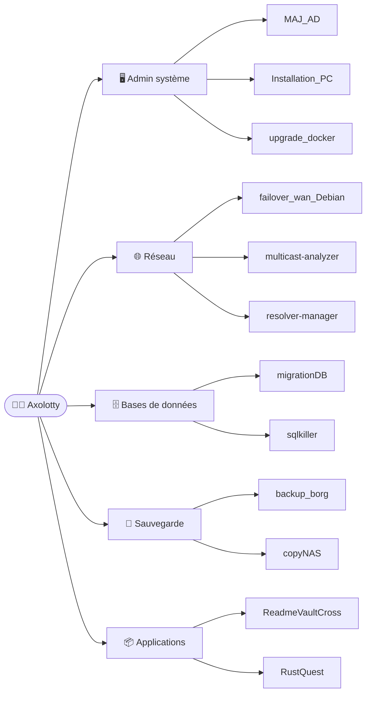

# 👋 Salut, c'est Valentin — alias `Axolotty`

> **Infrastructure IT · self-hosting · automatisation.** Si ça peut être scripté, ça le sera. 🏠

[](https://git.io/typing-svg)


---

## 🚀 À propos

```js
const axolotty = {
  rôle: "Infrastructure IT & Automatisation",
  os: ["Debian", "Ubuntu", "macOS", "Windows"],
  infra: ["Docker", "Nginx Proxy Manager", "OneDev", "NAS", "VPS"],
  scripting: ["Bash", "Python", "PowerShell", "Rust"],
  réseau: ["Cloudflare", "UniFi", "L2TP/IPsec", "iptables/ipset"],
  philosophie: "Si ça peut être scripté, ça le sera.",
};
```

---

## 🛠️ Stack technique

**Infra & DevOps**


**Langages & Dev**


**Données & Réseau**


---

## 🌟 Projets phares

| Projet | Ce que c'est | Stack |
|:--|:--|:--|
| **[ReadmeVaultCross](https://github.com/axolotty/ReadmeVaultCross)** | 🗄️ Gestionnaire de README multi-plateforme (macOS · Windows · Linux) | Tauri · Svelte |
| **[upgrade_docker](https://github.com/axolotty/upgrade_docker)** | 🐳 Mise à jour automatique des images Docker | Bash |
| **[backup_borg](https://github.com/axolotty/backup_borg)** | 💾 Sauvegarde Borg vers NAS (+ notif SMS) | Bash · Docker |
| **[failover_wan_Debian](https://github.com/axolotty/failover_wan_Debian)** | 🔀 Bascule automatique WAN1 / WAN2 sous Debian | Bash |
| **[migrationDB](https://github.com/axolotty/migrationDB)** | 🔄 Migration de bases de données MySQL entre serveurs | Bash |
| **[resolver-manager](https://github.com/axolotty/resolver-manager)** | 🌐 Contournement DNS macOS via `/etc/resolver` | Zsh |
| **[RustQuest](https://github.com/axolotty/RustQuest)** | 🦀 Plateforme d'apprentissage du Rust (100 niveaux) | Rust |

---

## 🗺️ Mon travail en un coup d'œil



---

## 🔗 Où me trouver

| | |
|:--|:--|
| 🐙 GitHub | [@axolotty](https://github.com/axolotty) |
| 🧬 Ma forge (OneDev) | [git.dasko.fr](https://git.dasko.fr) |
| ✉️ Mail | git@dasko.fr |

---

<picture>
  <source media="(prefers-color-scheme: dark)" srcset="https://raw.githubusercontent.com/axolotty/axolotty/output/github-snake-dark.svg" />
  <source media="(prefers-color-scheme: light)" srcset="https://raw.githubusercontent.com/axolotty/axolotty/output/github-snake.svg" />
  
</picture>
